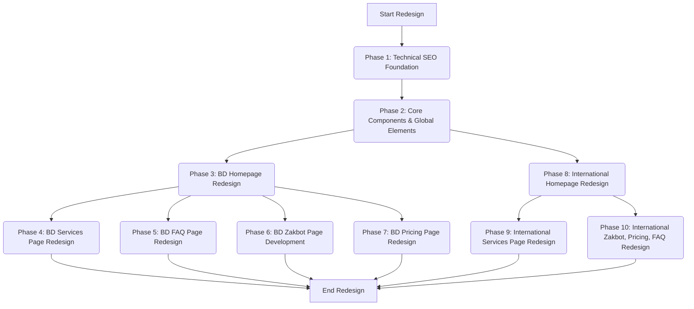

# Website Redesign Implementation Plan

This document outlines a detailed, modular implementation plan for the Zaktomate website redesign, split into 10 distinct phases. The core strategy involves maintaining Zaktomate's primary focus on the Bangladeshi EdTech and SME market on the main `zaktomate.com` domain while concurrently targeting international business owners through a dedicated `/en/` subfolder.

## High-Level Flow

## Detailed Plan by Phase

### Phase 1: Initial Setup & Technical SEO Foundation

This phase focuses on establishing the foundational technical elements crucial for search engine visibility and correct content delivery to the target audience.

*   **Implement URL & Folder Structure:**
    *   Establish `zaktomate.com/` for all content tailored to the Bangladeshi market.
    *   Create `zaktomate.com/en/` as a subfolder for all content aimed at a global business audience.
    *   Ensure dedicated pages like `/zakbot` and `/en/zakbot` follow this structure.
*   **Implement hreflang tags:**
    *   Add `<link rel="alternate" hreflang="en-BD" href="https://zaktomate.com/" />` to `zaktomate.com/` pages.
    *   Add `<link rel="alternate" hreflang="en" href="https://zaktomate.com/en/" />` to `zaktomate.com/` pages.
    *   Add `<link rel="alternate" hreflang="x-default" href="https://zaktomate.com/" />` to `zaktomate.com/` pages.
    *   Repeat the same hreflang tags on `zaktomate.com/en/` pages, pointing to the respective `en-BD` and `en` versions.
*   **Implement canonical tags:**
    *   Apply canonical tags on all pages to prevent duplicate content issues, ensuring each page points to its preferred version.
*   **Set up Google Analytics 4 (GA4):**
    *   Configure GA4 with separate data streams or audience segments to differentiate traffic from `/` (Bangladeshi) and `/en/` (International) paths.
*   **Implement conversion tracking:**
    *   Set up conversion tracking for all key Calls-to-Action (CTAs), distinguishing between local goals (e.g., "Request a Quote") and international goals (e.g., "Book a Free Consultation").
*   **Integrate heat mapping software:**
    *   Deploy heat mapping software (e.g., Hotjar) to independently analyze user behavior for each audience segment (`/` and `/en/`).
*   **Integrate an A/B testing platform:**
    *   Set up an A/B testing platform (e.g., Google Optimize, VWO) to continuously test and refine elements on both site versions.

### Phase 2: Core Components & Global Elements Development

This phase focuses on developing reusable components and content sections that will be shared across both the Bangladeshi and International versions of the website, ensuring consistency and efficiency.

*   **Develop reusable React components for "Brand Pillars":**
    *   Create components for "Simplicity", "Customization", "Affordability", and "Trust".
    *   Each component should include a headline, microcopy, proof element (e.g., short stat, mini-case, comparison badge, demo snippet), and a visual (e.g., gear turning → check mark, puzzle pieces, wallet/pricing tag, shield icon).
*   **Develop reusable React component for "Trust Signals":**
    *   Create a component to display common Zaktomate-related logos (OpenAI, Openrouter, Kilocode, Google Gemini, MongoDB, etc.) without explanations or claims.
*   **Implement the "About Zaktomate" section content:**
    *   Develop the content for the "About Zaktomate" section, which will be consistent across both audiences.
*   **Implement "The Team Behind Zaktomate" section content:**
    *   Develop the content for the team members (Abid Bin Yusuf, Shahriar Hossain Fahim, Shoyeb Morshed, Abdullah Ahsan), including their roles and focus areas. This content will be shared.
*   **Implement "Looking Ahead" and "Join Us" sections:**
    *   Develop the content for these sections, including headlines, subtext, and CTAs, which will be consistent across both audiences.

### Phase 3: Bangladeshi Homepage (`/`) Redesign

This phase focuses on updating the homepage content and layout specifically for the Bangladeshi audience, aligning with the local tone and positioning.

*   **Update Hero Section:**
    *   Change the Headline to: "Reinvent How You Work - With AI".
*   **Update "Target Market Section":**
    *   Change "Small Businesses" to "SMEs".
*   **Add "The Problem / Our Solution" section:**
    *   **Header (Problem Framing):** "The Hidden Costs of Running a Business in 2025" with microcopy.
    *   **Pain Points (The Problems):** Implement a three-column grid with icons for "Manual Customer Support", "Content Bottlenecks", and "Lead Generation Inefficiencies", each with detailed bullet points. Include microcopy below the grid.
    *   **Header (Solution Pivot):** "Zaktomate: Turning Bottlenecks Into Breakthroughs" with microcopy.
    *   **Solutions (What We Do):** Implement three mirrored columns directly under the problems for "AI-Powered Customer Support", "Automated Content Creation", and "Intelligent Lead Generation", each with detailed bullet points. Include microcopy below the solutions.
    *   **CTA (Close the Section):** "Ready to eliminate the friction in your business?" with primary CTA button "[ Get Started with OpsMate ]" and secondary CTA link "[ Explore One-Off Services ]".
*   **Rephrase "Zakbot Section":**
    *   Update the headline to "Zakbot – Your Always-On AI Assistant for Every Interaction" and rephrase the introductory microcopy.
    *   Update "Key Capabilities" with "Customer Support Excellence", "Academic Q&A Service", "Course & Content Creation", "Business & Service Teams", and "Multilingual Communication".
    *   Update CTAs to "Learn More" (redirect to `/zakbot` page) and "Try Zakbot Live".
*   **Integrate the "Brand Pillars" section:**
    *   Use the reusable component from Phase 2.
    *   Wrap with headline "Why Choose Zaktomate?".
    *   Implement the recommended layout (4 sections stacked, visual → headline → microcopy → proof).
    *   Add subtle animation on scroll (fade/slide).
*   **Integrate the "Trust Signals" section:**
    *   Use the reusable component from Phase 2.
*   **Rephrase "About Zaktomate" section:**
    *   Update the content as specified in the `website-redesign.txt` file.
    *   Add "[Learn More About Us]" CTA.

### Phase 4: Bangladeshi Services Page (`/services`) Redesign

This phase focuses on updating the services page content and tags for the Bangladeshi audience.

*   **Add "Coming Soon" tag to Zakdeck:**
    *   Visually indicate that Zakdeck is a "Coming Soon" service.
*   **Rephrase "Zakbot" service description:**
    *   Update the title to "Zakbot – Your Always-On AI Assistant".
    *   Update the description and "Works seamlessly on:", "Ideal for:", and "Now live and ready to connect" sections.
    *   Update CTA to "Learn More" (to `/zakbot` page).
*   **Move & Tag AI Exam Typing & Formatting to "Live now":**
    *   Update the status of this service.
*   **Move & Tag Lecture Notes & Summaries Generator to "Live Now":**
    *   Update the status of this service.

### Phase 5: Bangladeshi FAQ Page (`/faq`) Redesign

This phase focuses on updating the FAQ content and implementing specific visual and UX guidelines for the Bangladeshi audience.

*   **Update FAQ content:**
    *   **General:** Update Q1, Q2, Q3 with specified answers.
    *   **Chatbot Features:** Update Q4, Q5 with specified answers.
    *   **Service & Pricing:** Update Q6, Q7 with specified answers.
*   **Implement Visual & UX Guidelines:**
    *   **Icons:** Use education-themed visuals (book, student, classroom) alongside business visuals (handshake, chat bubble, document).
    *   **Layout:** Implement an accordion or collapsible questions format for easy browsing, especially on mobile.
    *   **Tone:** Ensure the tone is simple, practical, and client-first, avoiding jargon.
    *   **CTA Integration:** Add buttons under pricing answers: "[ Request a Local Demo ]" and "[ See Pricing Plans ]".

### Phase 6: Bangladeshi Zakbot Dedicated Page (`/zakbot`) Development

This phase involves creating a dedicated landing page for Zakbot, tailored for the Bangladeshi audience.

*   **Implement Hero Section:**
    *   Headline (EN): "Meet Zakbot — Your AI Assistant That Works 24/7".
    *   Subheadline: "Trained on your business data, Zakbot handles support, customer queries, and content — so your team can focus on growth."
    *   Primary CTA: "Try Zakbot Live" (opens demo sandbox modal).
    *   Secondary CTA: "Contact Us".
    *   Visual: Animated demo of Zakbot answering questions (gif or embedded widget).
*   **Implement "The Problems" section:**
    *   Three columns with icons for "Overloaded Support Teams", "Content & Exam Bottlenecks", and "Missed Growth Opportunities", each with detailed bullet points.
*   **Implement "The Solution: Zakbot for EdTechs & SMEs" section:**
    *   Introductory microcopy: "Zakbot is your 24/7 assistant—trained to handle your institution’s real needs."
    *   Subsections: "AI-Powered Student & Customer Support", "Dynamic Learning Content Generation" (Quiz Generation, Course Material, Exam Formatting), and "Lead Nurture & Engagement".
    *   Include "Showcase Plan demo" description.
*   **Implement "Key Features" section:**
    *   Visual grid with features: "Custom Knowledge Training", "Multi-Language", "Omnichannel Deployment", "Analytics Dashboard", "Handoff to Human", "Secure & Private".
*   **Integrate "Live Demo Sandbox":**
    *   Keep the existing live demo sandbox functionality.
*   **Implement "Closing CTA":**
    *   Headline: "Transform how your institution operates—free up teachers, empower staff, and give students faster support."
    *   CTA Buttons: "[ Request a Free Local Demo ]" and "[ Try Zakbot Live ]".

### Phase 7: Bangladeshi Pricing Page (`/pricing`) Redesign

This phase focuses on updating the pricing page with BDT pricing and a clear comparison between OpsMate plans and one-off services for the Bangladeshi audience.

*   **Implement Hero Section:**
    *   Headline: "Flexible Plans for Every Stage of AI Adoption".
    *   Subtext: "Whether you want a one-off project to test the waters or a long-term partner to scale AI across your business—we’ve got you covered."
*   **Update "Primary Track – OpsMate Plan":**
    *   Title: "OpsMate – Your Dedicated AI Acquisition Partner".
    *   Short Pitch: "Designed for businesses ready to integrate AI into their operations for sustained growth and efficiency."
    *   Key Value Points: End-to-end AI transformation support, Tailored workflows, Dedicated team support.
    *   CTA: "Start Your AI Journey".
    *   Update plan details for Ignite (BDT 10,000/month), Accelerate (BDT 25,000/month), Transform (BDT 40,000/month), and Pinnacle (From BDT 60,000/month) with specified features.
*   **Update "Secondary Track – One-Off Services":**
    *   Section Title: "Not Ready for Full OpsMate? Start Off with One-Off Services".
    *   Microcopy: "Test our expertise with a single project. Experience our quality, reliability, and impact—then scale into a long-term OpsMate partnership when you’re ready."
    *   Example One-Off Services: Zakbot Setup, Zakdeck Setup, Exam Formatter, Q&A Service, AI Summarization & Notes.
    *   Sub-text: "All services are delivered and priced as one-time setup only. Any recurring costs are on the client."
    *   Value Framing: Low commitment, high impact; Proof of trust; Custom-fit solutions; Bridge to OpsMate.
    *   Pricing Label: "Custom Pricing" with subtext.
    *   CTA Button: "[ Request a One-Off Project ]".
*   **Add "Comparison Table: One-Off Services vs OpsMate Plans":**
    *   Header: "Choose What Suits You Best".
    *   Include columns for "Feature / Plan", "One-Off Services", "Ignite", "Accelerate", "Transform", "Pinnacle".
    *   Populate the table with details for Commitment, Zakdeck, Zakbot, Workflows & Automations, Support, Onboarding & Training, Integration Level, Consulting, Scalability, and Pricing.
    *   Include CTA buttons for each plan.
*   **Add "Positioning Notes" microcopy:**
    *   Add microcopy for "One-Off Services" and "OpsMate Plans" below the table.
*   **Add visual effect to highlight "Accelerate":**
    *   Implement a visual effect to draw attention to the Accelerate plan.

### Phase 8: International Homepage (`/en/`) Redesign

This phase focuses on updating the homepage content and layout specifically for the International audience, aligning with the global tone and positioning.

*   **Implement Hero Section:**
    *   Headline: "Transform Your Business with AI".
    *   Subheadline: "We build, deploy, and manage AI systems that save you 20+ hours per week—without you lifting a finger."
    *   Primary CTA: "Get Free Consultation Call".
    *   Secondary CTA: "Contact Us".
*   **Implement "Problem / Solution Section":**
    *   Header: "Business Growth Is Stalled by Hidden Inefficiencies" with microcopy.
    *   **The Problems (3 Columns with Icons):** "Manual Support Costs", "Content Bottlenecks", "Inefficient Lead Generation", each with detailed bullet points.
    *   **The Zaktomate Solution – AI Automation That Scales With You:** Introductory microcopy.
    *   **Solutions:** "AI-Powered Customer & User Support", "Content & Workflow Automation", "Smarter Lead Generation & Nurturing", each with detailed bullet points.
*   **Implement "How It Works Section" (3-Step Process):**
    *   "Consultation Call", "Custom Development", "Launch & Support".
*   **Integrate the "Brand Pillars" section:**
    *   Use the reusable component from Phase 2.
    *   Wrap with headline "Why Choose Zaktomate?".
    *   Implement the recommended layout (4 sections stacked, visual → headline → microcopy → proof).
    *   Add subtle animation on scroll (fade/slide).
*   **Integrate the "Trust Signals" section:**
    *   Use the reusable component from Phase 2.
*   **Implement "Closing CTA":**
    *   Headline: "Ready to scale your business without scaling your overhead?".
    *   CTA Buttons: "[ Get Free Consultation ]" and "[ Try Zakbot Demo ]".

### Phase 9: International Services Page (`/en/services`) Redesign

This phase focuses on creating a comprehensive services page for the international audience, highlighting product demos and enterprise-grade trust.

*   **Implement Hero / Value proposition:**
    *   Header (H1): "Transform Operations with Custom AI Automation".
    *   Subhead: "We build, deploy and operate AI systems that cut repetitive work, accelerate growth, and integrate with your stack — delivered as managed service or productized modules."
    *   Primary CTA: "Get Free Consultation".
    *   Secondary CTA: "Try Zakbot Demo".
    *   Hero microcopy: "Proven automations for support, content, leads and internal ops — live in weeks, ROI in months."
    *   Visual: short looping demo of Zakbot answering queries (video/GIF).
*   **Implement "Quick service overview" (3–4 tile row):**
    *   Tiles: Zakbot, Zakdeck, Marketing Automation, OpsMate (Managed Program).
    *   Each tile: title, 1-line benefit, 3 micro bullets, small CTA (“See demo” / “Request quote”).
    *   Visual: compact icons + small animation on hover. Use productized badges (e.g., “Most popular” on OpsMate).
*   **Implement "Flagship product: Zakbot" deep module breakdown:**
    *   Section header (H2): "Zakbot — Your Multi-purpose AI Assistant".
    *   Intro microcopy.
    *   **Subsections:**
        *   A. Live Showcase (card / interactive demo).
        *   B. Core Capabilities (3-column feature grid): Knowledge Ingestion, RAG + Retrieval, Generation & Templates, Channels & Integrations, Analytics & SLAs.
        *   C. Packaged Use-Cases (cards): Educational Knowledge Bots, Course Material Generator, Customer Support Automation, Lead Qualification Bots, Internal Ops (HR/onboarding), Multi-Language Delivery.
        *   D. Quick technical note.
    *   Visuals: interactive carousel of use-case flows, small animated icons for channels.
*   **Implement "Content Automation — Zakdeck & Course Generator" section:**
    *   H2: "Zakdeck — Create Professional Learning & Marketing Content in Minutes".
    *   Intro microcopy.
    *   Feature bullets: Slide packs, Notes & Summaries, Quiz & Exam Formatter, Version control.
    *   Visual: two-column layout with demo thumbnails and CTA.
    *   Positioning: cross-sell with Zakbot.
*   **Implement "Marketing & Lead Automation" section:**
    *   H2: "Growth Automation — From Traffic to Qualified Pipeline".
    *   Microcopy.
    *   Capabilities list: Lead capture & qualification, Personalized nurture flows, Campaign scheduling & analytics, Persona presets.
    *   Visual: funnel graphic with animated bot.
    *   Tactical tie: prebuilt templates for common industries.
*   **Implement "Internal Ops & HR Automation" section:**
    *   H2: "Employee-facing Bots — Reduce interruptions, speed onboarding".
    *   Microcopy.
    *   Key features: policy lookup, benefits Q&A, guided onboarding, auto-generated HR docs.
    *   Visual: workflow diagram.
*   **Implement "Integrations & Technical Specifications" section:**
    *   H2: "Integrations, APIs & Architecture".
    *   Microcopy.
    *   List (icons): CRM, LMS, Messaging, Cloud, Data stores, Monitoring.
    *   Visual: grid of connector logos + small architecture diagram.
    *   Technical CTA: "View full integration guide".
*   **Implement "Security, Compliance & Responsible AI" section:**
    *   H2: "Security & Responsible AI".
    *   Microcopy.
    *   Subitems: tenant sharding, GDPR-friendly controls, model explainability.
    *   Visual: shield icon + simple checklist.
*   **Implement "Pricing & Packages" section:**
    *   H2: "Flexible commercial models — productized or managed".
    *   Microcopy.
    *   Structure: One-Off Projects, Product Tiers, OpsMate (managed program).
    *   Microcopy CTA: "Contact sales for a tailored quote."
*   **Implement "Onboarding & SLA" section:**
    *   H2: "Deployments in 2–4 weeks — clear milestones".
    *   Microcopy.
    *   Visual: 5-step timeline.
    *   SLA bullets: uptime targets, response times, monthly performance report.
*   **Implement "Case Studies / ROI highlights" section.**
*   **Implement "FAQ + Footer CTA" section.**

### Phase 10: International Zakbot Dedicated Page (`/en/zakbot`), Pricing Page (`/en/pricing`), and FAQ Page (`/en/faq`) Redesign

This final phase focuses on completing the international versions of the Zakbot dedicated page, pricing page, and FAQ page.

#### International Zakbot Dedicated Page (`/en/zakbot`)

*   **Implement Hero Section:**
    *   Headline (EN): "Meet Zakbot — Your AI Assistant That Works 24/7".
    *   Subheadline: "Trained on your business data, Zakbot handles support, customer queries, and content — so your team can focus on growth."
    *   Primary CTA: "Try Zakbot Live" (opens demo sandbox modal).
    *   Secondary CTA: "Contact Us".
    *   Visual: Animated demo of Zakbot answering questions (gif or embedded widget).
*   **Implement "The Problems" section:**
    *   "Manual Support Costs", "Content Bottlenecks", "Inefficient Lead Generation", each with detailed bullet points.
*   **Implement "The Solution: Zakbot, Built to Scale Globally" section:**
    *   Introductory microcopy: "Zakbot automates what holds businesses back—without sacrificing quality."
    *   Subsections: "AI-Powered Customer Support", "Content & Workflow Automation", "Smarter Lead Generation".
    *   Include "Showcase Plan demo" description.
*   **Implement "Key Features" section:**
    *   Visual grid with features: "Custom Knowledge Training", "Multi-Language", "Omnichannel Deployment", "Analytics Dashboard", "Handoff to Human", "Secure & Private".
*   **Integrate "Live Demo Sandbox":**
    *   Keep the existing live demo sandbox functionality.
*   **Implement "Zakbot Use Cases — Full Outline":**
    *   Section Header: "Zakbot in Action: Real AI Solutions for Real Businesses" with subheadline/microcopy.
    *   Visual Guideline: Full-width banner image or animation.
    *   Grid Layout Structure: 2x3 responsive grid with cards for "Customer Support Automation", "Lead Qualification & Sales Bots", "Internal Ops & HR Bots", "Marketing Automation", "Educational Knowledge-Base Chatbots", "Course Material Generator", "Multi-Language Content Automation". Each card should have an icon/illustration, title, subheader, 3-4 bullets, and microcopy.
*   **Implement "Closing Call-to-Action Block":**
    *   Headline: "One Bot. Endless Possibilities."
    *   Microcopy.
    *   CTA Buttons: "[ Try Zakbot Live ]" and "[ Book a Free Consultation ]".
*   **Implement "Pricing Preview":**
    *   EN Version: Ignite $197/mo, Accelerate $347/mo, Transform $497/mo.
    *   Visually Highlight Accelerate.
    *   CTA: "Compare Plans" (with anchor link to pricing page).
*   **Implement "How Zakbot Works (Step Process)":**
    *   Discovery, Training, Deployment, Optimization.
*   **Implement "Trust & Compliance":**
    *   Secured & privacy-first, Responsible AI, Optional NDAs / SLAs.
*   **Implement "Final Conversion CTA":**
    *   Headline: "Ready to Launch Your AI Assistant?".
    *   Primary CTA: "Try Zakbot Free" (sandbox).
    *   Secondary CTA: "Book Consultation".

#### International Pricing Page (`/en/pricing`)

*   **Implement Header Section:**
    *   Headline: "Simple, Transparent Pricing for Scalable AI Automation".
    *   Subheadline / Microcopy.
    *   Visual: Clean tiered pricing grid illustration, emphasize Accelerate as “Most Popular.”
*   **Implement "Pricing Plans Grid":**
    *   Ignite – Starter Plan ($197/month).
    *   Accelerate – Most Popular ($347/month).
    *   Transform – Advanced Plan ($497/month).
    *   Pinnacle – Enterprise Plan (Custom Quote, Starting from $697/month).
    *   Each plan with "Best For" and "Features" details.
    *   CTA Buttons for each plan.
*   **Implement "Comparison Table" (Below Grid):**
    *   Feature, Ignite, Accelerate, Transform, Pinnacle columns.
    *   Include Zakbot Messages, Pre-Built Automations, Custom Workflows & Integrations, Support, Onboarding Assistance, Training & Consulting.
*   **Implement "One-Off Services Section" (Add Below Plans):**
    *   Section Title: "Not Ready for a Full Plan? Try Our One-Off Services.".
    *   Microcopy.
    *   Examples: Zakbot Setup, Exam Formatter, Custom Q&A Bot, AI Summarization & Notes, Lead Gen Script Automation.
    *   Pricing: Custom quotes.
    *   CTA Button: "[ Request a One-Off Project ]".
*   **Implement "Closing CTA Section":**
    *   Headline: "Ready to Automate Your Business with AI?".
    *   Microcopy.
    *   CTA Buttons (Side by Side): "[ Get Free Consultation ]" and "[ Contact Us]".
    *   Visual: Animated Zakbot assistant illustration.

#### International FAQ Page (`/en/faq`)

*   **Update FAQ content:**
    *   **General:** Update Q1, Q2, Q3 with specified answers.
    *   **Chatbot Features:** Update Q4, Q5 with specified answers.
    *   **Service & Pricing:** Update Q6, Q7 with specified answers.
*   **Implement Visual & UX Guidelines:**
    *   **Layout:** Accordion format with smooth expand/collapse transitions; FAQ categories collapsed on load.
    *   **Icons:** Use subtle, context-appropriate icons next to each question.
    *   **Styling:** Clean sans-serif headings for questions, standard paragraph text for answers; bold key terms.
    *   **Connectivity:** Provide inline links where relevant (e.g., "demo access" to sandbox, "Starter, Growth, Scale" to pricing, "Contact Sales" to contact form).